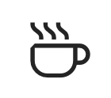

# flowstate README

Hello, fellow connoisseur of the Flow State.

## 

## Implemented Features

* Click on the small Coffee Icon in your Status Bar to start
* Set your goal for the coding session and the time you want to focus separted by ":" (e.g. Finish authentication : 45)
* Connect Slack
* Automatically be set to do not disturb in slack

Normal State Icon (Status Bar) 

Flow State (Status Bar)

## Next up

* Keep the Flow State alive by disabling as many disturbances as possible
    * Disable notifications in VScode
    * Disable desktop notifications
    * Integrate Slack to set status

* More advanced detection of the Flow State using a self trained machine learning model
    * Train the model with a few developers that rate their Flow State regularly (eg every 20 min)
    * Ship the model to a wider user base that provide ratings only on a daily basis
    * Ship the model to everyone

## Backlog

* Time tracking
* Web dashboard to see time coded and flow periods
* Smart time tracking that summarizes topics worked on
* Set music when in Flow State
* Integrate Teams to set do not disturb status when in Flow State
* Integrate Outlook to set blockers in calendar when in Flow State
* Integrate Outlook to set blockers in calendar when in Flow State

## Requirements

Currently no specific requirements.

## Extension Settings

This extension contributes the following settings:

* `flowstate.enable`: Enable/disable this extension.
* `flowstate.workbench.colorCustomizations`: Dim status bar color.

## Known Issues

No known issues yet.

## Release Notes

### 0.0.1

Initial release of Flow State

* Detect Flow State using basic logic
* Show the current state in the status bar
* Dim the theme colors when in Flow State
